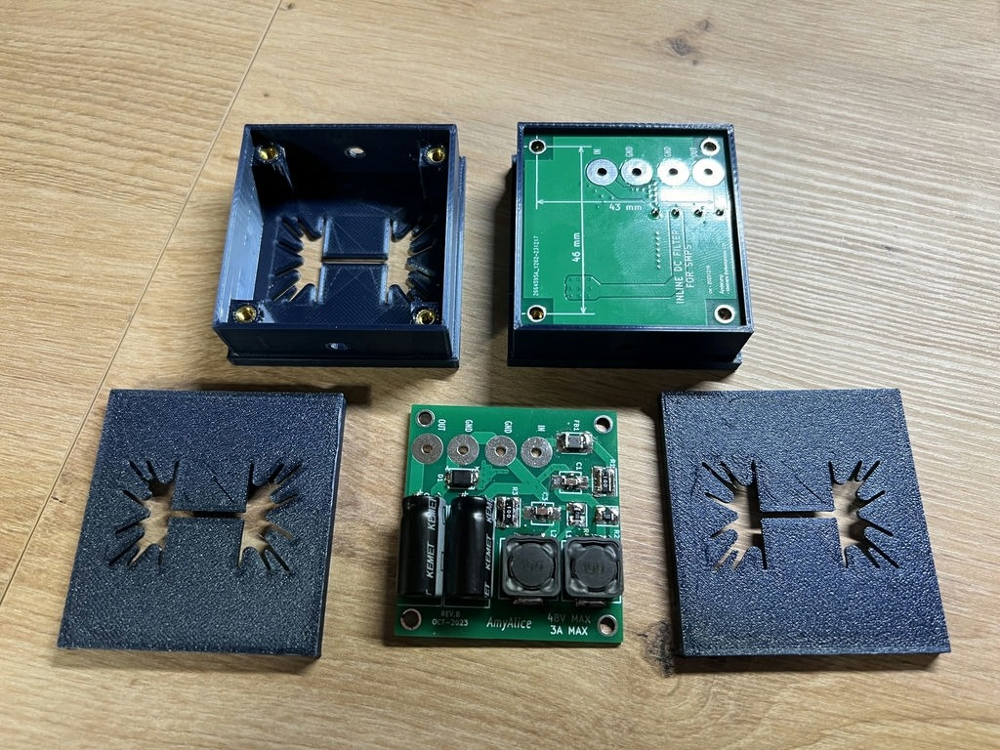

AmyAlice: DC filter for SMPS - housing

You can use it however you like

Mark Johnson article at diyaudio.com: https://www.diyaudio.com/community/threads/amyalice-dc-filter-for-smps-using-2-feedthru-capacitors-smd-assembly-max-3a-max-48v.405099/#post-7498193

Now on Makerworld: https://makerworld.com/en/models/666643#profileId-594224
